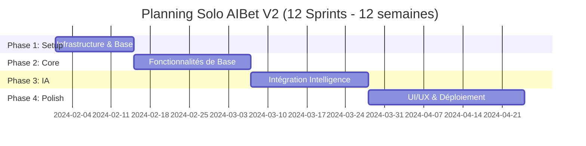
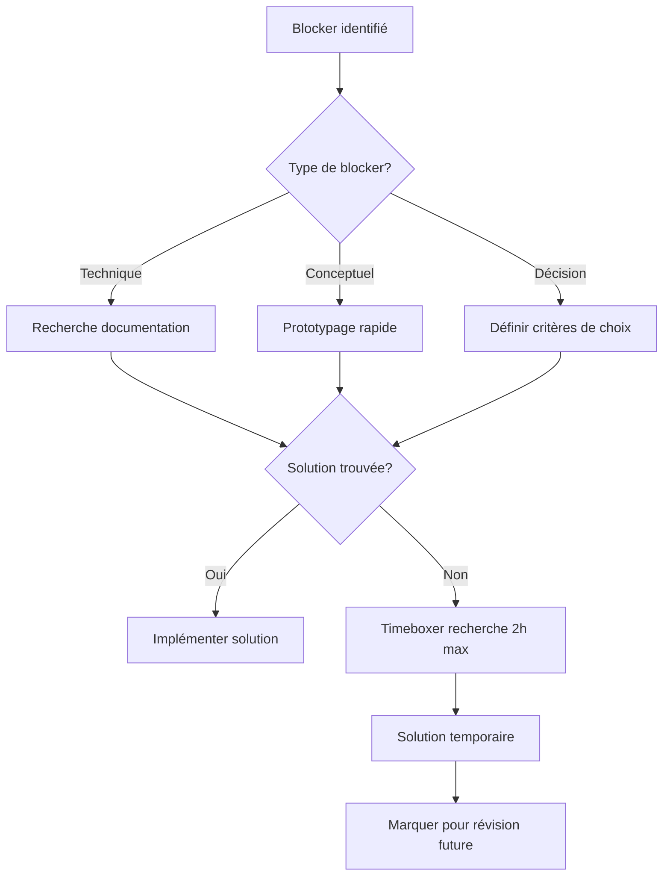
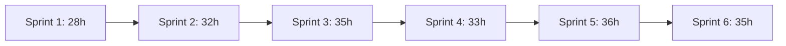

# Plan de Gestion des Sprints - AIBet V2 (Développeur Solo)

## Table des Matières
- [1. Méthodologie Agile Adaptée Solo](#1-méthodologie-agile-adaptée-solo)
- [2. Structure des Sprints Solo](#2-structure-des-sprints-solo)
- [3. Planification Personnelle](#3-planification-personnelle)
- [4. Exécution et Auto-monitoring](#4-exécution-et-auto-monitoring)
- [5. Auto-évaluation et Amélioration](#5-auto-évaluation-et-amélioration)
- [6. Tests et Déploiement Solo](#6-tests-et-déploiement-solo)

---

## 1. Méthodologie Agile Adaptée Solo

### 1.1 Framework Adapté pour Développeur Solo

**Méthodologie :** Scrum Solo (Personal Scrum)  
**Durée des Sprints :** 1 semaine (5 jours ouvrables)  
**Objectif :** Maintenir un rythme soutenu avec des livrables fréquents

### 1.2 Rôles Multiples

#### Vous êtes à la fois :
- **Product Owner** : Définition des priorités et validation
- **Scrum Master** : Organisation et amélioration du processus  
- **Developer** : Développement full-stack
- **QA Tester** : Tests et validation qualité
- **DevOps** : Déploiement et infrastructure

### 1.3 Outils Simplifiés

**Outil Principal :** GitHub Projects (intégré au repo)  
**Board Type :** Kanban simplifié  
**Tracking :** GitHub Issues avec labels

**Configuration GitHub Projects :**
```
Colonnes du Board :
├── 📋 Backlog (À faire)
├── 🎯 Sprint Actuel (En cours cette semaine)
├── 💻 En Développement
├── 🧪 À Tester
└── ✅ Terminé
```

---

## 2. Structure des Sprints Solo

### 2.1 Calendrier Adapté (12 Sprints - 12 semaines)



### 2.2 Sprints Redéfinis pour Solo

#### Sprint 1 (Semaine 1) : Infrastructure Docker
**Objectif :** Environnement de développement opérationnel
**Temps estimé :** 30-35 heures

- **Issue #1** : Configuration Docker Compose (8h)
- **Issue #2** : Setup PostgreSQL + Redis (4h)
- **Issue #3** : Structure Django de base (6h)
- **Issue #4** : Authentification JWT (8h)
- **Issue #5** : CI/CD GitHub Actions basique (6h)

#### Sprint 2 (Semaine 2) : Modèles de Base
**Objectif :** Structure de données fonctionnelle
**Temps estimé :** 32-38 heures

- **Issue #6** : Modèles User/Profile étendus (6h)
- **Issue #7** : Modèles Match et Prediction (8h)
- **Issue #8** : API REST basique (10h)
- **Issue #9** : Admin Django configuré (4h)
- **Issue #10** : Tests unitaires de base (6h)

#### Sprint 3 (Semaine 3) : Frontend Foundation
**Objectif :** Interface utilisateur de base
**Temps estimé :** 35-40 heures

- **Issue #11** : Setup Next.js + Tailwind (6h)
- **Issue #12** : Authentification frontend (8h)
- **Issue #13** : Layout et navigation (8h)
- **Issue #14** : Pages principales (dashboard, prédictions) (12h)
- **Issue #15** : Responsive design basique (6h)

#### Sprint 4 (Semaine 4) : Collecte de Données
**Objectif :** Pipeline de données automatisé
**Temps estimé :** 32-38 heures

- **Issue #16** : Client API-Football (10h)
- **Issue #17** : Modèles de données étendus (6h)
- **Issue #18** : Tâches Celery de base (8h)
- **Issue #19** : Cache Redis (4h)
- **Issue #20** : Tests d'intégration (6h)

#### Sprint 5 (Semaine 5) : Intégration IA
**Objectif :** Prédictions GPT-4o fonctionnelles
**Temps estimé :** 38-42 heures

- **Issue #21** : Client OpenAI GPT-4o (12h)
- **Issue #22** : Système de prompts (8h)
- **Issue #23** : Pipeline de génération (10h)
- **Issue #24** : Gestion des erreurs IA (6h)
- **Issue #25** : Tests des prédictions (4h)

#### Sprint 6 (Semaine 6) : Système Bankroll
**Objectif :** Gestion financière virtuelle
**Temps estimé :** 30-36 heures

- **Issue #26** : Modèles Bankroll complets (8h)
- **Issue #27** : Logique de paris (10h)
- **Issue #28** : Interface bankroll frontend (10h)
- **Issue #29** : Historique et statistiques (6h)

#### Sprint 7 (Semaine 7) : UI/UX Avancée
**Objectif :** Interface utilisateur polie
**Temps estimé :** 35-40 heures

- **Issue #30** : Design system cohérent (10h)
- **Issue #31** : Animations et micro-interactions (8h)
- **Issue #32** : Pages de détail avancées (10h)
- **Issue #33** : Optimisations mobile (8h)

#### Sprint 8 (Semaine 8) : Fonctionnalités Premium
**Objectif :** Système premium avec Stripe
**Temps estimé :** 32-38 heures

- **Issue #34** : Intégration Stripe (12h)
- **Issue #35** : Système d'abonnements (8h)
- **Issue #36** : Fonctionnalités premium (8h)
- **Issue #37** : Tests paiements (6h)

#### Sprint 9 (Semaine 9) : Performance & Monitoring
**Objectif :** Optimisations et observabilité
**Temps estimé :** 30-35 heures

- **Issue #38** : Optimisations base de données (8h)
- **Issue #39** : Monitoring Prometheus (8h)
- **Issue #40** : Cache avancé (6h)
- **Issue #41** : Logging structuré (4h)
- **Issue #42** : Health checks (4h)

#### Sprint 10 (Semaine 10) : Tests Complets
**Objectif :** Couverture de tests maximale
**Temps estimé :** 30-35 heures

- **Issue #43** : Tests E2E Cypress (12h)
- **Issue #44** : Tests de charge (8h)
- **Issue #45** : Tests de sécurité (6h)
- **Issue #46** : Correction bugs critiques (6h)

#### Sprint 11 (Semaine 11) : Production Ready
**Objectif :** Préparation déploiement
**Temps estimé :** 28-32 heures

- **Issue #47** : Configuration production (8h)
- **Issue #48** : Scripts de déploiement (6h)
- **Issue #49** : Documentation utilisateur (8h)
- **Issue #50** : Tests en environnement staging (6h)

#### Sprint 12 (Semaine 12) : Lancement
**Objectif :** Mise en production
**Temps estimé :** 25-30 heures

- **Issue #51** : Déploiement production (8h)
- **Issue #52** : Tests post-déploiement (4h)
- **Issue #53** : Monitoring lancement (6h)
- **Issue #54** : Documentation finale (4h)
- **Issue #55** : Communication lancement (3h)

---

## 3. Planification Personnelle

### 3.1 Sprint Planning Solo (1h par semaine)

**Format :** Session de planification personnelle le dimanche soir  
**Durée :** 60 minutes maximum

#### Agenda Sprint Planning Solo (1h)
```
20:00 - 20:15 : Review sprint précédent
20:15 - 20:30 : Analyse des priorités
20:30 - 20:45 : Sélection des issues pour la semaine
20:45 - 21:00 : Planification détaillée des tâches
```

### 3.2 Estimation Solo

#### Système d'Estimation Simplifié
- **XS (2-3h)** : Bug fix, configuration simple
- **S (4-6h)** : Feature simple, CRUD basique
- **M (6-8h)** : Feature standard, intégration
- **L (8-12h)** : Feature complexe, nouveau module
- **XL (12h+)** : Epic à décomposer

#### Capacité Hebdomadaire Réaliste
- **Temps total disponible :** 40h/semaine
- **Temps de développement effectif :** 30-35h
- **Buffer pour imprévus :** 5-10h

### 3.3 Exemple Sprint Backlog Solo (Sprint 1)

#### Issues Sélectionnées
```markdown
### Sprint 1 - Infrastructure Docker (30-35h)

🐳 **Issue #1: Configuration Docker Compose** [L - 8h]
- [ ] Dockerfile pour Django API
- [ ] Service PostgreSQL  
- [ ] Service Redis
- [ ] docker-compose.yml complet
- [ ] Scripts de développement

🗄️ **Issue #2: Setup PostgreSQL + Redis** [S - 4h]  
- [ ] Configuration PostgreSQL optimisée
- [ ] Redis pour cache et sessions
- [ ] Variables d'environnement
- [ ] Health checks

⚙️ **Issue #3: Structure Django de base** [M - 6h]
- [ ] Apps Django (accounts, predictions, bankroll)
- [ ] Settings de développement/production
- [ ] URL routing de base
- [ ] Middleware configuration

🔐 **Issue #4: Authentification JWT** [L - 8h]
- [ ] django-rest-framework-simplejwt
- [ ] Endpoints login/logout/refresh
- [ ] Modèle User étendu
- [ ] Tests d'authentification

🚀 **Issue #5: CI/CD GitHub Actions** [M - 6h]
- [ ] Workflow de tests automatisés
- [ ] Linting et formatage
- [ ] Coverage reports
- [ ] Notification de build
```

### 3.4 Definition of Done Solo

Une issue est terminée si :

✅ **Code** développé et testé localement  
✅ **Tests** écrits (unitaires minimum)  
✅ **Documentation** technique mise à jour  
✅ **Git commit** avec message descriptif  
✅ **Fonctionnalité** testée manuellement  
✅ **Pas de régression** sur les features existantes

---

## 4. Exécution et Auto-monitoring

### 4.1 Routine Quotidienne Solo

#### Morning Routine (15 minutes)
```
08:30 - 08:35 : Review des issues du jour
08:35 - 08:40 : Check des notifications GitHub
08:40 - 08:45 : Priorisation des tâches
```

#### Evening Review (15 minutes)
```
18:00 - 18:05 : Commit et push du travail
18:05 - 18:10 : Mise à jour des issues GitHub
18:10 - 18:15 : Planning du lendemain
```

### 4.2 Tracking Solo avec GitHub

#### Labels GitHub Personnalisés
- `🎯 sprint-current` : Issue du sprint actuel
- `🔥 priority-high` : Priorité élevée
- `🐛 bug` : Bug à corriger
- `✨ feature` : Nouvelle fonctionnalité
- `📚 documentation` : Documentation
- `🧪 testing` : Tests
- `⚡ performance` : Optimisation

#### Métriques Personnelles

```markdown
## Sprint 1 Metrics

### Vélocité
- Issues plannifiées : 5 (32h estimées)
- Issues terminées : 4 (28h réelles) 
- Taux de completion : 80%

### Qualité  
- Bugs introduits : 2
- Tests coverage : 78%
- Code review self : ✅

### Apprentissage
- Nouvelles technos : Docker Compose
- Défis techniques : Configuration Redis
- Amélioration : Meilleure estimation des tâches
```

### 4.3 Gestion des Blockers Solo

#### Auto-déblocage Strategy



#### Types de Blockers Fréquents en Solo

**🔧 Blockers Techniques :**
- Documentation insuffisante
- Configuration complexe
- Dépendances conflictuelles
- **Solution :** Timebox de recherche + solution temporaire

**🤔 Blockers de Décision :**
- Choix architectural
- Priorité des features
- Design UX/UI
- **Solution :** Prototypage rapide + validation par usage

---

## 5. Auto-évaluation et Amélioration

### 5.1 Sprint Review Solo (30 minutes)

**Format :** Auto-évaluation le vendredi après-midi  
**Objectif :** Validation et démonstration personnelle

#### Template Sprint Review Solo
```markdown
# Sprint X Review - [Date]

## 🎯 Objectifs Sprint
- [x] Objectif 1 : Infrastructure Docker ✅
- [x] Objectif 2 : Authentification JWT ✅  
- [ ] Objectif 3 : Tests automatisés ❌

## 📊 Métriques
- Issues terminées : 4/5 (80%)
- Heures travaillées : 32h
- Heures estimées : 30h  
- Écart estimation : +6%

## 🎪 Démonstration
- ✅ Docker compose up fonctionne
- ✅ API accessible et documentée
- ✅ Authentification frontend/backend
- ❌ Tests automatisés incomplets

## 📝 Notes
- Docker plus complexe que prévu (+2h)
- JWT bien maîtrisé (-1h)
- Tests à prioriser sprint suivant
```

### 5.2 Sprint Retrospective Solo (20 minutes)

#### Format "WWW" (What Went Well)

**🟢 What Went Well**
- Productivité élevée en matinée
- Docker maîtrisé rapidement
- Code quality maintenue

**🔴 What Went Wrong**  
- Sous-estimation temps de debug
- Tests négligés en fin de sprint
- Trop de context switching

**🔧 What to Improve**
- Bloquer 20% du temps pour tests
- Sessions focus de 2h sans interruption
- Meilleure estimation des tâches techniques

### 5.3 Métriques d'Amélioration Continue

#### Velocity Tracking Solo



#### Personal KPIs

| Métrique | Sprint 1 | Sprint 2 | Sprint 3 | Objectif |
|----------|----------|----------|----------|----------|
| Heures productives | 28h | 32h | 35h | 30-35h |
| Issues terminées | 80% | 85% | 90% | >85% |
| Bugs introduits | 3 | 2 | 1 | <2 |
| Tests coverage | 78% | 82% | 85% | >80% |
| Learning time | 4h | 3h | 2h | 2-4h |

---

## 6. Tests et Déploiement Solo

### 6.1 Stratégie de Tests Solo

#### Approche Pragmatique
- **60% Tests unitaires** : Fonctions critiques
- **30% Tests d'intégration** : APIs et workflow
- **10% Tests E2E** : Parcours utilisateur principaux

#### Automation Testing Solo

```python
# tests/solo_test_strategy.py

class SoloTestStrategy:
    """
    Stratégie de tests adaptée pour développeur solo
    Focus sur les tests critiques et automatisation maximale
    """
    
    def critical_tests(self):
        """Tests à écrire en priorité"""
        return [
            "test_user_authentication",
            "test_prediction_generation", 
            "test_bankroll_calculation",
            "test_payment_processing",
            "test_data_collection_pipeline"
        ]
    
    def integration_tests(self):
        """Tests d'intégration essentiels"""
        return [
            "test_complete_prediction_workflow",
            "test_user_registration_to_first_bet",
            "test_payment_to_premium_access"
        ]
    
    def e2e_scenarios(self):
        """Scénarios E2E minimum viable"""
        return [
            "test_user_journey_complete",
            "test_premium_subscription_flow"
        ]
```

### 6.2 CI/CD Solo Simplifié

#### GitHub Actions Solo

```yaml
# .github/workflows/solo-ci.yml
name: Solo CI/CD

on:
  push:
    branches: [ main, develop ]

jobs:
  test-and-deploy:
    runs-on: ubuntu-latest
    steps:
      - uses: actions/checkout@v3
      
      - name: Setup Python
        uses: actions/setup-python@v4
        with:
          python-version: '3.9'
          
      - name: Install dependencies
        run: pip install -r requirements.txt
        
      - name: Run critical tests
        run: |
          python manage.py test --settings=aibet.test_settings
          pytest tests/critical/ -v
          
      - name: Security check
        run: bandit -r . -x venv/
        
      - name: Deploy to staging
        if: github.ref == 'refs/heads/develop'
        run: |
          echo "Deploy to staging"
          # Script de déploiement staging
          
      - name: Deploy to production  
        if: github.ref == 'refs/heads/main'
        run: |
          echo "Deploy to production"
          # Script de déploiement production
```

### 6.3 Déploiement Solo

#### Infrastructure Minimale

```yaml
# docker-compose.prod.yml
version: '3.8'

services:
  api:
    build: .
    ports:
      - "8000:8000"
    environment:
      - ENV=production
      - DEBUG=False
    depends_on:
      - db
      - redis
      
  db:
    image: postgres:15
    volumes:
      - postgres_data:/var/lib/postgresql/data
    environment:
      - POSTGRES_DB=aibet_prod
      
  redis:
    image: redis:7-alpine
    
  nginx:
    image: nginx:alpine
    ports:
      - "80:80"
      - "443:443"
    volumes:
      - ./nginx.conf:/etc/nginx/nginx.conf
      - ./ssl:/etc/ssl/certs
```

### 6.4 Monitoring Solo

#### Monitoring Essentiel

```python
# monitoring/solo_monitoring.py

class SoloMonitoring:
    """Monitoring minimal mais efficace pour développeur solo"""
    
    def health_checks(self):
        """Checks de santé automatisés"""
        return {
            "database": self.check_db_connection(),
            "redis": self.check_redis_connection(), 
            "api_response": self.check_api_health(),
            "disk_space": self.check_disk_space(),
            "memory_usage": self.check_memory()
        }
    
    def daily_report(self):
        """Rapport quotidien automatique"""
        return {
            "users_active": self.count_active_users(),
            "predictions_generated": self.count_daily_predictions(),
            "errors_count": self.count_errors(),
            "performance_avg": self.avg_response_time()
        }
```

#### Alertes Simples

```bash
# scripts/simple_alerts.sh
#!/bin/bash

# Vérification quotidienne automatique
if [ $(curl -s -o /dev/null -w "%{http_code}" https://api.aibet.fr/health) != "200" ]; then
    echo "❌ API DOWN" | mail -s "AIBet Alert" votre-email@example.com
fi

# Vérification espace disque
if [ $(df / | tail -1 | awk '{print $5}' | sed 's/%//') -gt 80 ]; then
    echo "⚠️ Disk space > 80%" | mail -s "Disk Alert" votre-email@example.com
fi
```